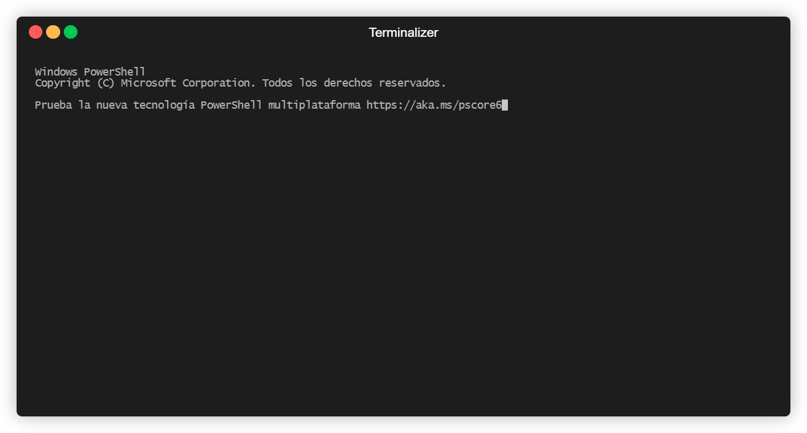

# pynipper-ng 🔧

_Repository stats:_

[](https://pynipper-ng.readthedocs.io/?badge=latest)


_Code stats:_

[](https://github.com/syn-4ck/pynipper-ng/actions/workflows/codeql-analysis.yml)
[](https://github.com/syn-4ck/pynipper-ng/actions/workflows/gitguardian-scan.yml)
[](https://github.com/syn-4ck/pynipper-ng/actions/workflows/snyk.yml)
[](https://sonarcloud.io/summary/new_code?id=syn-4ck_pynipper-ng)
[](https://github.com/syn-4ck/pynipper-ng/actions/workflows/flake8.yml)
[](https://github.com/syn-4ck/pynipper-ng/actions/workflows/yaml-lint.yml)
[](https://github.com/syn-4ck/pynipper-ng/actions/workflows/build-python.yml)


<br/>

<p align="center">
  
</p>

<br/>

## Table of contents
1. [What is pynipper-ng](#what-is-pynipper-ng)
2. [Install](#install)
3. [Quickstart](#quickstart-and-options)
4. [More information](#more-information)
5. [References](#references)

## What is pynipper-ng? ❔
pynipper-ng is a **configuration security analyzer for network devices**. The goal of this tool is check the vulnerabilities and misconfigurations of routers, firewalls and switches reporting the issues in a simple way.

This tool is based on [nipper-ng](https://github.com/arpitn30/nipper-ng), updated and translated to Python. The project wants to improve the set of rules that detect security misconfigurations of the network devices using multiple standard benchmarks (like [CIS Benchmark](https://www.cisecurity.org/cis-benchmarks/)) and integrate the tool with APIs (like [PSIRT Cisco API](https://developer.cisco.com/docs/psirt/#!overview/overview)) to scan known vulnerabilities.

* Official documentation: https://pynipper-ng.readthedocs.io/
* Web page: https://syn-4ck.github.io/pynipper-ng/

## Install 🧰

If you want to install the tool, please review the [installation docs](https://pynipper-ng.readthedocs.io/installation/).

## Quickstart and options 💻

```BASH
pynipper-ng -d IOS_ROUTER -i tests\test_data\cisco_ios_example.conf -o HTML -f ./report.html -x
```

<br/>

<br/>

### Options ☑️

| Flag | OPTION        | DESCRIPTION                                                                                                      | MANDATORY? | DEFAULT VALUE |
|------|---------------|------------------------------------------------------------------------------------------------------------------|------------|--------------|
| -h   | --help        | Display a help message                                                                                           | NO         | N/A             |
| -d   | --device      | Device type to analyze (1)                                                                                       | YES        |             |
| -i   | --input       | Configuration device file to analyze (file contains standard output redirection of `show configuration` command) | YES        |             |
| -o   | --output-type | Report type (HTML or JSON)                                                                                       | NO         | HTML          |
| -f   | --output-filename | Report filename                                                                                              | NO         | report.html
| -x   | --offline         | Disable APIs integration                                                                                     | NO         | True             |
| -c   | --configuration   | Configuration file to pynipper-ng (2)                                                                        | NO         | default.conf    |


(1) Check [here](src/devices/README.md) the devices supported

(2) Check [Pynipper-ng configuration file](#pynipper-ng-configuration-file) to know more about it.

## More information ℹ️

### Pynipper-ng Configuration File 📂

The configuration file is used to define some properties and customize the scans.

#### Pynipper-ng Configuration File: PSIRT Cisco API 📁

To use the PSIRT Cisco API you must provide the API keys. To get it: [https://apiconsole.cisco.com/](https://apiconsole.cisco.com/)

```conf
[Cisco]
CLIENT_ID = <your-client-id>
CLIENT_SECRET = <your-client-secret-token>
```

### Contributing 👪

Contribution are welcome! Please follow the steps defined in CONTRIBUTING file and share your improvements with the community.

### CISCO IOS API integration 🗺️

Get your credentials and put into the configuration file.

### Pynipper plugins 🏗️

Pynipper-ng detects device configuration weaknesses based on plugins. Pynipper plugins checks into the network device configuration with regex if a property is set or not, and report it when this is not secure.

#### Pynipper plugins summary 📁

Available plugins: [check here](src/analyze/README.md)

#### Implements your plugins 🖱️

You can implements your own plugins. You should clone the repository and create the plugins in `src/analyze/cisco/<device_type>/plugins`. To improve the pynipper-ng tool you can contribute adding your work :).

To create your own plugins, follow [this guidelines](src/analyze/README.md)

## Image 🖼️

<br/>

<br/>

## References 🔗
[nipper-ng](https://github.com/arpitn30/nipper-ng)
