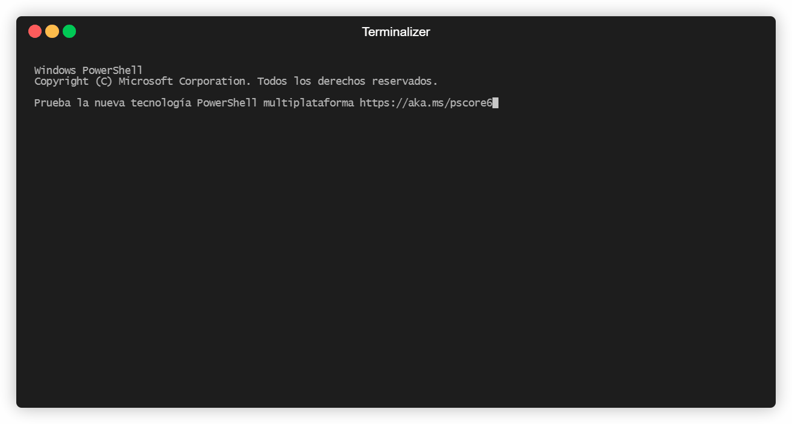

<br/><br/>

<p align="center">
  
</p>

<br/>

---

## What is pynipper-ng? ❔
pynipper-ng is a **configuration security analyzer for network devices**. The goal of this tool is check the vulnerabilities and misconfigurations of routers, firewalls and switches reporting the issues in a simple way.

This tool is based on [nipper-ng](https://github.com/arpitn30/nipper-ng), updated and translated to Python. The project wants to improve the set of rules that detect security misconfigurations of the network devices using multiple standard benchmarks (like [CIS Benchmark](https://www.cisecurity.org/cis-benchmarks/)) and integrate the tool with APIs (like [PSIRT Cisco API](https://developer.cisco.com/docs/psirt/#!overview/overview)) to scan known vulnerabilities.

* Official documentation: https://pynipper-ng.readthedocs.io/

---

## Installation

### Using pip (Python 3.10+)

Clone the repository and install dependencies:

```bash
git clone https://github.com/syn-4ck/pynipper-ng.git
cd pynipper-ng
pip install -r requirements.txt
pip install .
```

### Using Docker

Build the Docker image:

```bash
docker build -t pynipper-ng .
```

---

## Usage

### With pip (local install)

Run the tool from your terminal:

```bash
pynipper-ng --device IOS_ROUTER \
            --input tests/test_data/cisco_ios_example.conf \
            --output-type HTML \
            --output-filename ./report.html \
            --offline
```

### With Docker

Mount your config and output directories, then run:

```bash
docker run --rm \
  -v "$(pwd)/config_file_dir:/data:ro" \
  -v "/tmp:/output" \
  pynipper-ng \
  --device IOS_ROUTER \
  --input /data/cisco_ios_example.conf \
  --output-type HTML \
  --output-filename /output/report.html \
  --offline
```

Replace the input and output paths as needed for your environment.

---

## Demo 💻

<br/>

<br/>

### Options ☑️

| Flag | OPTION        | DESCRIPTION                                                                                                      | MANDATORY? | DEFAULT VALUE |
|------|---------------|------------------------------------------------------------------------------------------------------------------|------------|--------------|
| -h   | --help        | Display a help message                                                                                           | NO         | N/A             |
| -d   | --device      | Device type to analyze (1)                                                                                       | YES        |             |
| -i   | --input       | Configuration device file to analyze (file contains standard output redirection of `show configuration` command) | YES        |             |
| -o   | --output-type | Report type (HTML or JSON)                                                                                       | NO         | HTML          |
| -f   | --output-filename | Report filename                                                                                              | NO         | report.html
| -x   | --offline         | Disable APIs integration                                                                                     | NO         | True             |
| -c   | --configuration   | Configuration file to pynipper-ng (2)                                                                        | NO         | default.conf    |


(1) Check [here](src/devices/README.md) the devices supported

(2) Check [Pynipper-ng configuration file](#pynipper-ng-configuration-file) to know more about it.

---

### Pynipper-ng Configuration File 📂

The configuration file is used to define some properties and customize the scans.

#### Pynipper-ng Configuration File: PSIRT Cisco API 📁

To use the PSIRT Cisco API you must provide the API keys. To get it: [https://apiconsole.cisco.com/](https://apiconsole.cisco.com/)

```conf
[Cisco]
CLIENT_ID = <your-client-id>
CLIENT_SECRET = <your-client-secret-token>
```

---

### Contributing 👪

Contribution are welcome! Please follow the steps defined in CONTRIBUTING file and share your improvements with the community.

### CISCO IOS API integration 🗺️

Get your credentials and put into the configuration file.

---

### Pynipper plugins 🏗️

Pynipper-ng detects device configuration weaknesses based on plugins. Pynipper plugins checks into the network device configuration with regex if a property is set or not, and report it when this is not secure.

#### Implements your plugins 🖱️

You can implements your own plugins. You should clone the repository and create the plugins in `src/analyze/cisco/<device_type>/plugins`. To improve the pynipper-ng tool you can contribute adding your work :).

To create your own plugins, follow [this guidelines](CONTRIBUTING.md)

---

## Security and Quality

This project passes:

✔️ Snyk code & open-source
✔️ SonarCloud
✔️ Trivy
✔️ GitGuardian
✔️ CodeQL
✔️ Flake8

## References 🔗
[nipper-ng](https://github.com/arpitn30/nipper-ng)
